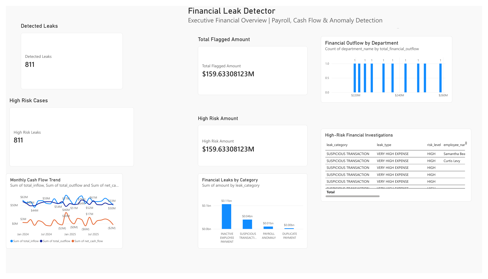
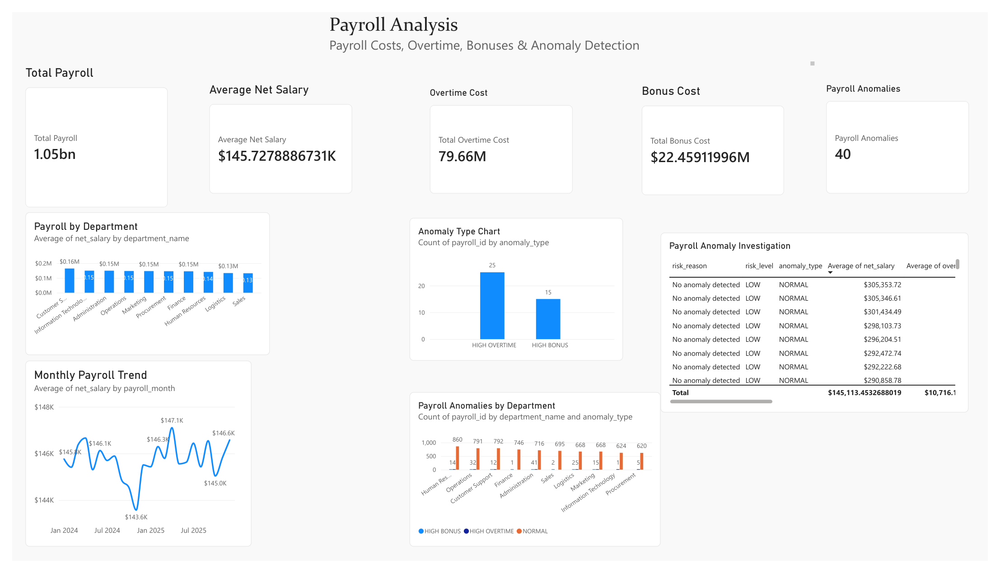
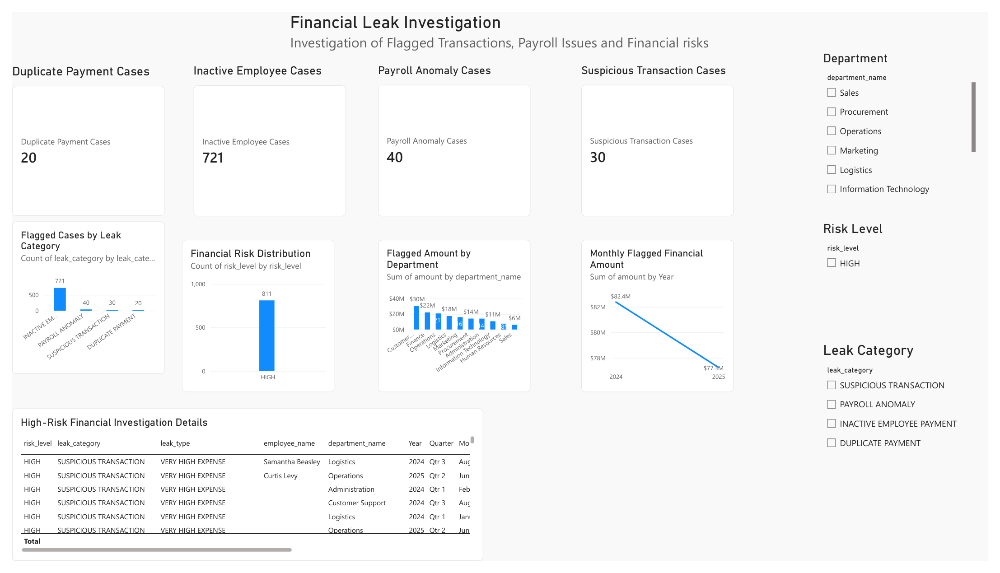
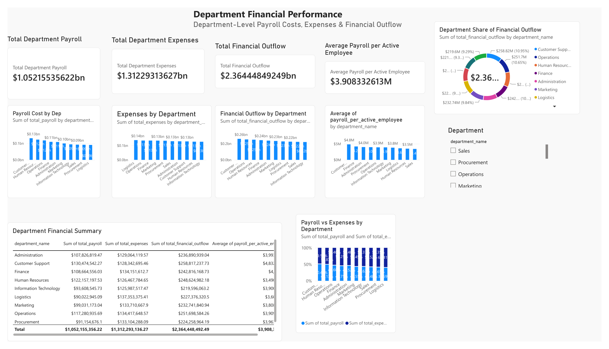
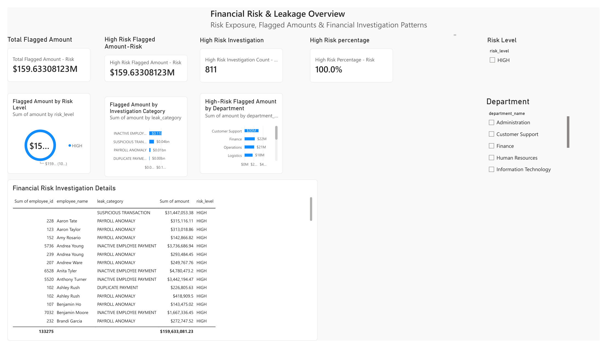
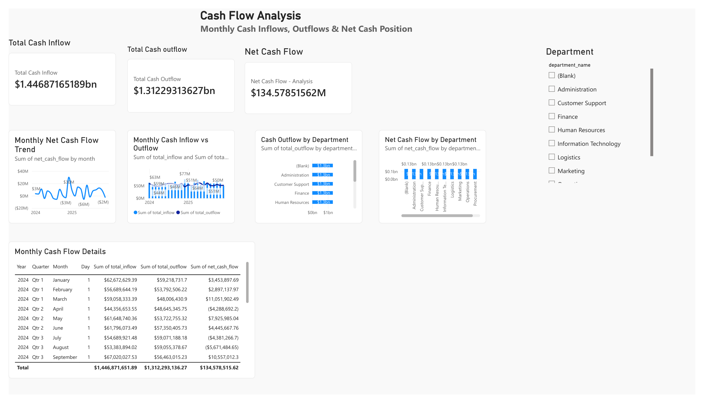

# Financial Leak Detector

## Financial Analytics & Risk Intelligence Platform

The **Financial Leak Detector** is a data analytics project designed to identify potential financial leakage, payroll-related anomalies, departmental cost drivers, financial risk patterns, and cash-flow trends.

The project combines **Python, PostgreSQL, SQL, and Power BI** to transform raw financial data into an interactive six-page executive analytics dashboard.

> **Important:** Flagged amounts and risk indicators represent records identified for investigation. They should not automatically be interpreted as confirmed financial losses.

---

## Project Objective

The objective of this project is to help finance teams investigate:

* Potential financial leakage
* High-risk financial transactions
* Payroll costs and anomalies
* Department-level financial outflow
* Employee-related financial risk
* Monthly cash-flow performance
* Areas requiring further financial investigation

---

## Technology Stack

| Technology   | Purpose                                    |
| ------------ | ------------------------------------------ |
| Python       | Data generation and data loading           |
| PostgreSQL   | Data storage and analytical processing     |
| SQL          | Data transformation and financial analysis |
| Power BI     | Interactive dashboard and visualization    |
| Git & GitHub | Version control and portfolio presentation |

---

## Data Sources

The project uses five primary datasets:

* `employees.csv`
* `departments.csv`
* `payroll.csv`
* `financial_transactions.csv`
* `cash_flow.csv`

These datasets represent employee information, organizational departments, payroll activity, financial transactions, and cash-flow information.

---

# Power BI Dashboard

The final Power BI report contains **six analytical pages**.

## 1. Executive Dashboard

Provides a high-level overview of the organization's financial position and key financial indicators.

Focus areas include:

* Overall financial performance
* Key financial KPIs
* Potential financial leakage
* Payroll exposure
* Financial risk indicators

## 2. Financial Overview

Provides a broader analysis of the organization's financial activity.

The page helps users understand:

* Revenue and expenditure patterns
* Overall financial movement
* Major financial indicators
* Key areas requiring further analysis

## 3. Financial Leak Investigation

Focuses on investigating potentially problematic financial records.

The analysis includes:

* Flagged financial amounts
* Investigation categories
* Financial transaction patterns
* High-value flagged records
* Detailed investigation information

## 4. Department Financial Performance

Analyzes financial performance across departments.

Key analysis includes:

* Total department payroll
* Department expenses
* Total financial outflow
* Average payroll per active employee
* Department financial comparisons
* Department-level financial summaries

## 5. Financial Risk & Leakage Overview

Focuses on financial risk classification and investigation priorities.

The dashboard analyzes:

* Total flagged amounts
* High-risk flagged amounts
* High-risk investigations
* High-risk investigation percentage
* Risk-level distribution
* Investigation categories
* High-risk amounts by department
* Investigation-level details

## 6. Cash Flow Analysis

Analyzes the organization's cash movement over time.

The page includes:

* Total cash outflow
* Net cash flow
* Monthly net cash-flow trends
* Monthly inflow versus outflow
* Cash outflow by department
* Net cash flow by department
* Detailed monthly cash-flow information

---

# Dashboard Preview

### Executive Dashboard



### Financial Overview



### Financial Leak Investigation



### Department Financial Performance



### Financial Risk & Leakage Overview



### Cash Flow Analysis



### Full Power BI Report

The complete six-page Power BI report is also available as a PDF:

`powerbi/financial_leak_detector.pdf`

---

# Analytical Workflow

The project follows this general workflow:

```text
Raw Financial Data
       ↓
Python Data Processing
       ↓
PostgreSQL Database
       ↓
SQL Financial Analysis
       ↓
Analytical Tables / Views
       ↓
Power BI Data Model
       ↓
Six-Page Executive Dashboard
       ↓
Financial Investigation & Insights
```

---

# Key Analytical Areas

### Financial Leakage

Identifies financial records that require further investigation based on defined analytical rules.

### Payroll Analysis

Examines payroll costs and department-level payroll exposure.

### Risk Analysis

Classifies flagged records into risk levels and highlights high-risk financial activity.

### Department Analysis

Compares payroll, expenses, and financial outflow across departments.

### Cash-Flow Analysis

Tracks monthly inflows, outflows, and net cash-flow movement.

---

# Project Structure

```text
Financial_Leak_Detector
│
├── data
│   ├── cash_flow.csv
│   ├── departments.csv
│   ├── employees.csv
│   ├── financial_transactions.csv
│   └── payroll.csv
│
├── docs
│   ├── executive_dashboard.png
│   ├── financial_overview.png
│   ├── financial_leak_investigation.png
│   ├── department_financial_performance.png
│   ├── financial_risk_leakage.png
│   └── cash_flow_analysis.png
│
├── powerbi
│   └── financial_leak_detector.pdf
│
├── python
│   ├── generate_data.py
│   └── load_data.py
│
├── sql
│
├── .gitignore
└── README.md
```

---

# Business Value

The project demonstrates how financial data can be transformed into an investigation-oriented analytics solution.

Potential users include:

* Finance teams
* Financial analysts
* Internal audit teams
* Payroll analysts
* Management
* Business intelligence teams

The dashboard can help users move from **raw financial records to visual investigation and decision-support analysis**.

---

# Portfolio Highlights

This project demonstrates practical experience with:

* Data preparation
* Python
* PostgreSQL
* SQL
* Financial analytics
* Payroll analysis
* Risk analysis
* Data visualization
* Power BI dashboard development
* KPI development
* Interactive filtering
* Business intelligence reporting

---

# Disclaimer

This project is intended as a **portfolio and analytical demonstration**.

Financial records identified as flagged or high-risk are analytical indicators for investigation and should not automatically be treated as confirmed fraud, confirmed losses, or evidence of wrongdoing without appropriate verification and investigation.

---

## Author

**Kelvin Mungai**

Data Analytics | Python | SQL | PostgreSQL | Power BI
